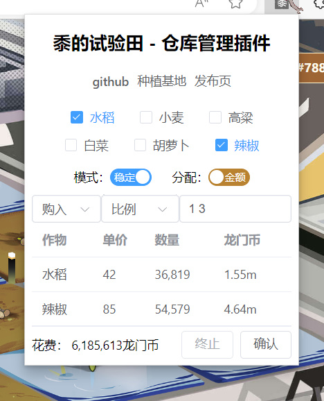

# 黍的试验田 - 仓库管理插件

## 功能

按照 ALL/定量/百分比/比例 四种模式 购入/卖出 作物   
支持大于999的操作，无需多次点击✅  

## 下载

[Firefox](https://addons.mozilla.org/zh-CN/firefox/addon/shu-plot-purchase-extension)
[Firefox安卓](https://addons.mozilla.org/zh-CN/firefox/addon/sppeffa)

[Github release](https://github.com/Arkfans/Shu-Plot-Purchase-Extension/releases)  
[蓝奏云](https://meeboo.lanzouq.com/b029rqh8f)

## 安装方法

解压后根据图示操作  
[Chrome安装](./Chrome安装指南.png)  
[Edge安装](./Edge安装指南.png)

*注意：不支持手机*

